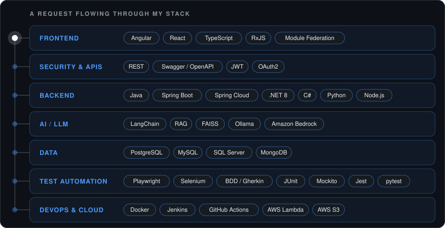

  

  <b>Software Engineer</b> · Full-Stack · AI / LLM · Test Automation 
  Tunisia · Open to new opportunities

  
  

  

---

## About

Software engineer with a telecommunications engineering degree (ENETCOM, Sfax) and a background in network validation and QA automation. I build REST APIs and microservices with **Spring Boot** and **.NET 8**, modular frontends with **Angular** and **React**, and LLM-powered tools (RAG, agents) with **Python** and **LangChain**. I care about code that is tested, automated, and easy to maintain.

## What I Do

  
  
  

## Tech Stack

  

  

  <a href="mailto:seifeddin.tlijani@enetcom.u-sfax.tn">Email</a> · <a href="https://www.linkedin.com/in/seif-tlijani-482897200/">LinkedIn</a>

